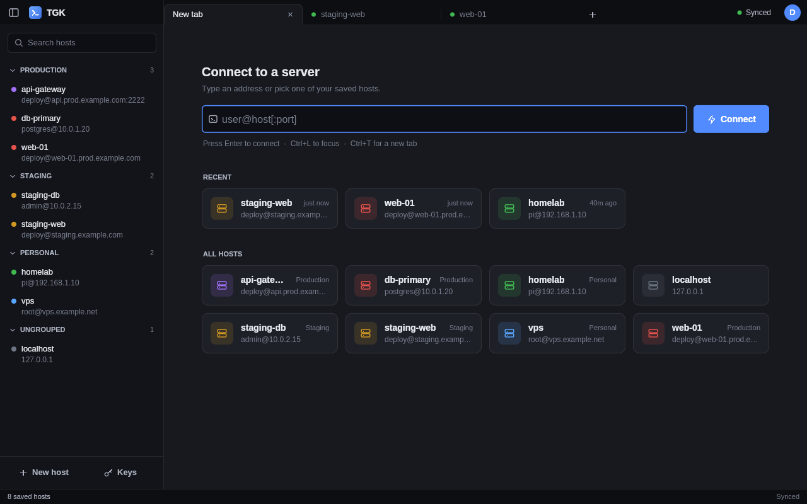
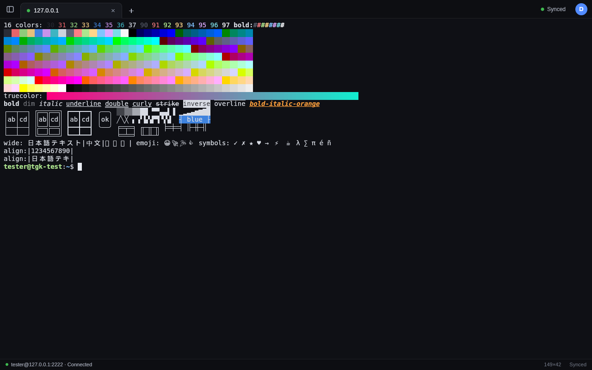
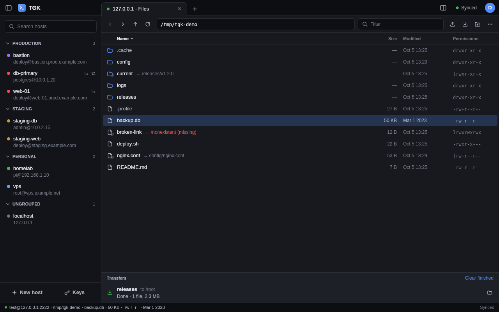
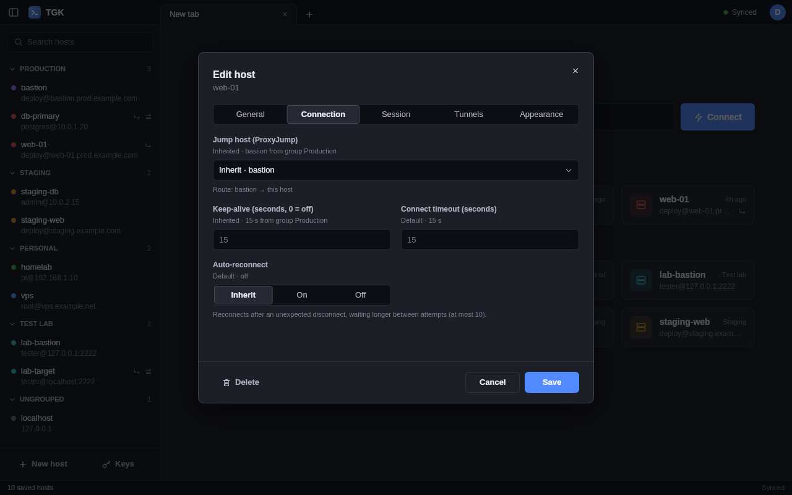
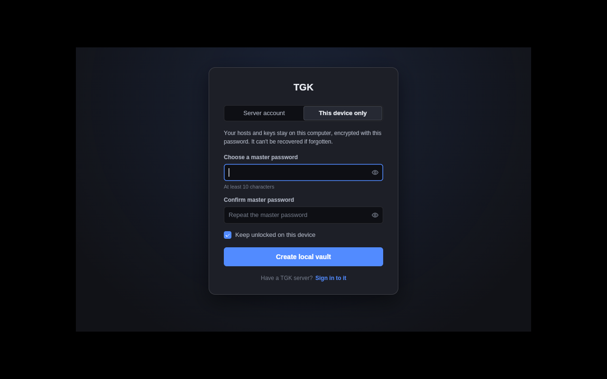

# TGK

A cross-platform SSH session and credential manager with browser-style tabs. Keep your hosts, keys and connection
settings in an end-to-end encrypted vault — synced across devices through a lightweight self-hosted server, or kept
entirely on one machine.



## Features

**Sessions**
- Tabs like a browser: every tab is an SSH terminal (or a host's files); a new tab offers quick connect (`user@host:port`) that also
  searches your saved hosts by name, user or host. Drag tabs to reorder them, or onto another tab to show both side by
  side. Any number of tabs: the tab strip scrolls (mouse wheel, touchpad, the ‹ › arrows) and lists them all.
- Split view: show several sessions at once — 2 or 3 side by side, stacked, 1 large + 2, grids of 4 or 6 (the layout
  button in the tab strip), or split any pane right / down (`Ctrl+Shift+E` / `Ctrl+Shift+O`). Drag the dividers to
  resize, `Alt+arrows` to move between panes, `Ctrl+Shift+X` to maximize one; each pane stays a tab of its own and can
  be dragged in or out of the split view. Drag a pane's title bar to rearrange: next to another pane on any side, onto
  a pane to swap them, onto the tab strip to make it a tab again.
- Reopen my tabs (Settings → Startup, off by default): your tabs and split views are saved in the vault when you close
  TGK, sign out or lock it (and as you work), and reopened on whichever device you sign in next. Only which hosts were
  open is saved, never passwords; a session connects when you open its tab.
- Updates: a while after start (never during it) and about twice a day, TGK asks GitHub for a newer release
  (on the Nightly channel, chosen in Settings → Startup, also the latest nightly build). A newer one only adds a small note to the status bar: "Update now"
  downloads it in the background, checks it against GitHub's checksum and installs it when you restart (or close) TGK;
  "Download from GitHub", "Skip this version" and "Remind me later" are there too. Turn it off in Settings → Startup;
  "Check for updates" in the account menu asks right away. Builds run from source only offer the download page.
- Built-in xterm-compatible terminal: 256 colors and truecolor, alternate screen (vim, htop, mc, tmux), scrollback,
  mouse reporting, bracketed paste, wide characters, selection with copy/paste.
- Auth with private keys (OpenSSH, PEM/PKCS#8 or PuTTY, with passphrase), password or keyboard-interactive; host key
  verification on first connect and on change.

**Files (SFTP)**
- A Files tab per host (right-click a host → Browse files, or from a terminal's menu): folders with back/forward/up, a
  path to type, a name filter, hidden files (`Ctrl+H`) and sortable columns; through the same jump hosts, credentials
  and host-key checks as the terminal.
- Upload files and folders (pick them or drop them on the window) and download them — to your Downloads folder or
  anywhere — with a transfer panel (progress, speed, time left, cancel). Existing names ask Replace / Skip; files are
  written under a temporary name and put in place when complete; times and permissions are kept.
- Edit text files right in TGK, beside the file list (double-click, F4; F3 to view): find and replace, go to line,
  undo; Ctrl+S saves straight to the server, keeping permissions and owner, and warns if the file changed meanwhile.
  Files only root may read or write are opened and saved through sudo when you ask. Logs open at their end and follow
  new lines; large files show their end.
- Open or edit a file in a program on your computer: every save is uploaded back. On Windows, programs and scripts
  from a server open as text, never run.
- New folder / file, rename, move, delete (links are removed, never what they point to), permissions, copy paths, open
  a terminal in the folder. Files tabs are reopened at their folder with "Reopen my tabs".
- Split view with panes side by side (*Open a pane beside…*): another folder of the same host, this computer, or another
  saved host. Drag items onto the other pane (or one of its folders), or press `F5` (copy) / `F6` (move): within a
  host a move is a rename; between two hosts files go through a private buffer on this computer, so the hosts never
  need to reach each other, or — if you choose — host A copies straight to host B over SSH with B's credentials from
  the vault (checked against B's trusted host key, removed from A afterwards).

**Hosts**
- Groups, search, tag colors, identities (username + password or private key) shared between hosts.
- Keys & identities: generate a new key (Ed25519, or RSA 4096 for older servers) right in the vault, copy any key's
  public half as an `authorized_keys` line, or load a key already on this device — TGK lists the ones in `~/.ssh`,
  `~/.ssh/config` and saved PuTTY / WinSCP sessions (never searching the whole disk).
- Per-host options with inheritance (built-in default ← global ← group ← host):
  - Jump hosts (chains up to 4 hops), keep-alive, connect timeout, automatic reconnect.
  - Local, remote and dynamic (SOCKS) port forwarding, started with the session.
  - Startup command, environment variables, terminal type.
  - Font (bundled DejaVu Sans Mono or VT323, or any installed monospace font), font size, color scheme (TGK Dark,
    Solarized, Dracula, Nord, Gruvbox, One Dark, and retro ones: Green CRT, Amber CRT, Commodore 64, MS-DOS,
    Synthwave '84), opt-in legacy algorithms for old devices.
- Terminal settings (font, size, colors, scrollback, cursor, copy-on-select) are kept in the vault and follow you to
  every device.

**Agents (MCP)**
- Let Claude Code or any MCP client work on your saved hosts through TGK: run commands, read, search and edit files,
  copy files up and down (SFTP, with a fallback for servers without it). Off by default (Settings → Agents); per
  host, group or for all hosts you choose Read only, Ask (you approve every change in TGK, with the exact command or a
  diff) or Full, plus commands that may run without asking and protected paths (keys and other secrets out of the
  box). Commands with sudo are always approved by you, and TGK supplies the password. The agent never sees passwords
  or keys; every call is shown live, mirrored in an "Agent log" tab and kept in an audit log.
  See [docs/AGENTS.md](docs/AGENTS.md).

**Vault**
- **Server mode:** sign up from the app, Google Authenticator (TOTP) required, stay signed in per device, see and
  sign out your other devices, change password. Changes sync in the background and work offline.
- **Local mode:** no server at all — a local SQLite vault protected by a master password.
- Move between modes at any time (upload a local vault to an account, save an offline copy of an account),
  plus encrypted `.tgkbackup` export/import.

| Terminal | Files (SFTP) |
|---|---|
|  |  |

| Per-host options | Local vault |
|---|---|
|  |  |

## Security model

- The vault is **end-to-end encrypted**. Your password never leaves the device: PBKDF2-SHA256 (600k iterations)
  derives an authentication key and a key-encryption key (HKDF); a random vault key, wrapped by the latter, encrypts
  every host, group, identity and known host separately with AES-256-GCM, bound to its item id.
- The server stores only opaque blobs, a verifier of the authentication key, the TOTP secret and session tokens (hashed).
- **A forgotten password (or master password) cannot be recovered** — nobody, including the server admin, can decrypt the vault.
- On a device where you choose "stay signed in" / "keep unlocked", the session token and vault key are stored in the
  OS keyring (DPAPI on Windows, libsecret via `secret-tool` on Linux, otherwise a file readable only by you).
- Agents (when you allow them) reach TGK through a local socket guarded by a token readable only by you; TGK keeps the
  credentials and enforces each host's agent access (see [docs/AGENTS.md](docs/AGENTS.md)).

## Getting started

Ready-to-run builds (no .NET needed) from the [latest release](https://github.com/AlexandruMindra/TGK/releases/latest),
or the [nightly](https://github.com/AlexandruMindra/TGK/releases/tag/nightly) build of `main` (versioning rules:
[docs/RELEASING.md](docs/RELEASING.md), changes: [CHANGELOG.md](CHANGELOG.md)):

| System | Download | |
|---|---|---|
| Windows 10/11 (x64) | `TGK-win-x64-setup.exe` | Installer for your user, no administrator rights. Portable: `TGK-win-x64.zip`. |
| Linux (x64) | `TGK-x86_64.AppImage` | `chmod +x TGK-x86_64.AppImage` and run it. Portable folder: `TGK-linux-x64.tar.gz`. |
| macOS, Apple Silicon (M1 and later) | `TGK-osx-arm64.dmg` | Drag TGK to Applications. |
| macOS, Intel | `TGK-osx-x64.dmg` | Drag TGK to Applications. |

Once installed, TGK updates itself ("Update now" in the status bar). The macOS builds are not signed with an Apple
Developer ID or notarized yet: the first time, right-click TGK in Applications and choose **Open**, or allow it in
System Settings → Privacy & Security. If macOS says the app "is damaged", run `xattr -cr /Applications/TGK.app` once.
Tested mainly on Linux; Windows is supported but less tested, macOS is new.

To build from source you need the [.NET 10 SDK](https://dotnet.microsoft.com/download).

```bash
git clone https://github.com/AlexandruMindra/TGK.git
cd TGK
dotnet run --project src/TGK.Client
```

Pick **This device only** on the sign-in screen to use TGK without a server.

### Sync server

```bash
dotnet run --project src/TGK.Server -- serve --urls http://127.0.0.1:5080
```

Then choose **Server account → Create an account** in the app. For anything beyond localhost, put the server behind
HTTPS (the client refuses plain `http://` except on loopback). Admin commands:

```bash
tgk-server users                        # list accounts and pending invites
tgk-server user disable|enable|delete <name>
tgk-server user reset-totp <name>       # lost phone: the user enrolls a new authenticator at next sign-in
tgk-server user revoke-sessions <name>
tgk-server user create <name>           # reserve a name and print a one-time invite code
tgk-server registration on|off|status
```

Publishing, systemd, Caddy and backups: [docs/SERVER.md](docs/SERVER.md).

## Development

```text
src/TGK.Terminal   VT/xterm emulator (no UI dependencies)
src/TGK.Protocol   shared DTOs, vault crypto, TOTP
src/TGK.Core       models, vault services (server, local), SSH sessions (SSH.NET)
src/TGK.Client     desktop app (Blossom: Silk.NET + SkiaSharp)
src/TGK.Server     sync server (ASP.NET Core minimal API + SQLite)
tests/             xunit test projects
```

```bash
scripts/test.sh    # builds and runs all test projects in parallel (~10 s)
```

End-to-end SSH tests against a local test server and GUI checks: [docs/DEV-TESTING.md](docs/DEV-TESTING.md).

## License

[MIT](LICENSE). Third-party components: [Blossom](https://github.com/cretucosmin3/Blossom) (MIT),
[SSH.NET](https://github.com/sshnet/SSH.NET) (MIT), SkiaSharp and Silk.NET (MIT), QRCoder (MIT), GLFW (zlib),
DejaVu Sans Mono ([license](assets/fonts/DejaVu-LICENSE.txt)), VT323 (SIL Open Font License,
[license](assets/fonts/VT323-LICENSE.txt)).
